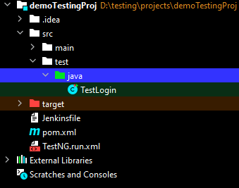

# Project: CI/CD Jenkins Pipeline for Selenium Test using Maven

## Description
This project contains a basic Selenium script written in Java to test the login functionality of [tutorialsninja.com/demo](https://tutorialsninja.com/demo). The test script is designed to be executed using TestNG framework and Maven.

## Files

- **Jenkinsfile**: Pipeline script for Jenkins CI/CD pipeline configuration.

## Setup Instructions
1. Ensure you have Java and Maven installed on your system.
2. Clone this repository to your local machine.
3. Open the project in your preferred Java IDE.
4. Install the necessary dependencies using Maven (`mvn clean install`).
5. Configure your Selenium WebDriver settings in the test script if needed.
6. Run the test script (`LoginTest.java`) using TestNG.

## Jenkins Pipeline Configuration
1. Create a new Jenkins pipeline project.
2. Choose "Pipeline script from SCM" option for the pipeline script.
3. Set the SCM to the URL of this GitHub repository.
4. Specify the Jenkinsfile as the script to use.
5. Save the pipeline configuration.
6. Run the Jenkins pipeline job.

## Outcome
The Jenkins pipeline will execute the following stages:
- **Checkout**: Clones the GitHub repository.
- **Build**: Cleans the Maven project.
- **Test**: Executes the Selenium tests using Maven.
- **Deploy**: Echoes a message indicating the success of the deployment stage.

Upon successful execution of the pipeline, you should see a message indicating the deployment stage was successful.

**Note:** Ensure you have appropriate permissions and configurations set up in your Jenkins environment for executing the pipeline and running the Selenium tests.

